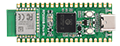

# Hardware Reference

This repository collects hardware documentation, schematics, pinouts, and example code for embedded development boards used in personal and professional IoT/embedded projects.
Each board has its own folder with a detailed `SUMMARY.md`, schematic images, datasheet references, and demo source code.

---

## Boards

| Board | MCU | Connectivity | Form Factor | Folder |
|-------|-----|-------------|-------------|--------|
| [ESP32-2424S012](#esp32-2424s012) | ESP32-C3 (RISC-V, 160 MHz) | Wi-Fi b/g/n · BLE 5.0 | 1.28″ round display module | [ESP32-2424S012/](hardware/ESP32-2424S012/) |
| [JC-ESP32P4-M3-DEV](#jc-esp32p4-m3-dev) | ESP32-P4 (dual-core RISC-V, 400 MHz) + ESP32-C6 co-proc | Wi-Fi 6 · BT 5 · 100 M Ethernet | Full dev board with MIPI display | [ESP32-P4-M3-DEV/](hardware/ESP32-P4-M3-DEV/) |
| [HyperPixel 2.1 Round](#hyperpixel-21-round) | — (display only) | — | 2.1″ round IPS touch display · RGB666 parallel | [HyperPixel-Round/](hardware/HyperPixel-Round/) |
| [Waveshare RP2350B-Plus-W](#waveshare-rp2350b-plus-w) | RP2350B (dual-core Cortex-M33 / RISC-V, 150 MHz) | Wi-Fi 4 · BT 5.2 | Pico-compatible · 41 GPIO · 16 MB flash | [RP2350B-Plus-W/](hardware/RP2350B-Plus-W/) |

---

## ESP32-2424S012

**1.28″ round TFT smart-watch / IoT display module**  
Manufacturer: Shenzhen Jingcai Intelligent (深圳市晶彩智能有限公司)

| | |
|-|-|
| MCU | ESP32-C3-MINI-1U — single-core RISC-V @ 160 MHz, 4 MB flash |
| Display | 1.28″ circular IPS TFT — 240 × 240 px — GC9A01 driver (SPI) |
| Touch | CST816D capacitive — I2C @ 0x15 (SDA=GPIO4, SCL=GPIO5) |
| Power | USB Type-C · TP4054 Li-Ion charger · 3.3 V DC-DC |
| Debug | USB full-speed (native ESP32-C3 USB-JTAG, no separate chip) |

→ **[Full hardware reference](hardware/ESP32-2424S012/SUMMARY.md)**

→ **[Copilot instructions template](hardware/ESP32-2424S012/example.copilot-instructions.md)**

---

## JC-ESP32P4-M3-DEV

**High-performance development board with MIPI display, Ethernet, and dual-USB**  
Manufacturer: Guition / JC 

| | |
|-|-|
| Main MCU | ESP32-P4 — dual-core RISC-V @ 400 MHz · 16 MB flash · 32 MB PSRAM |
| Co-processor | ESP32-C6-MINI — Wi-Fi 6 (802.11ax) + Bluetooth 5 / BLE (SDIO) |
| Display | MIPI 2-lane DSI · JD9365 driver · 800 × 1280 px |
| Touch | GT911 capacitive — I2C (SDA=GPIO7, SCL=GPIO8) |
| Ethernet | 100 Mbps IP101 PHY |
| USB | USB 2.0 OTG HS + USB 1.1 OTG FS (both Type-C) |
| Audio | ES8311 codec · onboard mic · 8 Ω / 2 W speaker header |
| Storage | SDIO 3.0 TF card · Li-Ion battery connector |

→ **[Full hardware reference](hardware/ESP32-P4-M3-DEV/SUMMARY.md)**  
→ **[Copilot instructions template](hardware/ESP32-P4-M3-DEV/example.copilot-instructions.md)**

---

## HyperPixel 2.1 Round

**2.1″ round IPS capacitive touchscreen — RGB666 parallel interface**  
Manufacturer: Pimoroni

| | |
|-|-|
| Display | 2.1″ circular IPS — 480 × 480 px — ST7701S driver |
| Touch | FT5x06 capacitive — I2C @ 0x15 |
| Interface | RGB666 parallel (18-bit DPI) + 3-wire SPI init |
| Pixel Clock | 19.2 MHz |
| Designed for | Raspberry Pi 40-pin header — adaptable to ESP32-P4 |

→ **[Full hardware reference](hardware/HyperPixel-Round/SUMMARY.md)**

---

## Waveshare RP2350B-Plus-W

**Raspberry Pi RP2350B development board — Pico-compatible with Wi-Fi & Bluetooth**  
Manufacturer: Waveshare

| | |
|-|-|
| MCU | RP2350B — dual-core Cortex-M33 **or** RISC-V @ 150 MHz |
| RAM / Flash | 520 KB SRAM · 16 MB QSPI flash |
| GPIO | **41 multi-function GPIO** (vs 26 on standard Pico 2) |
| ADC | 6× 12-bit channels |
| PIO | 12 state machines (3 blocks) |
| Wireless | CYW43439 — Wi-Fi 4 (802.11n) · Bluetooth 5.2 BLE |
| USB | USB 1.1 Type-C |
| Form factor | Raspberry Pi Pico / Pico W compatible |

→ **[Full hardware reference](hardware/RP2350B-Plus-W/SUMMARY.md)**

