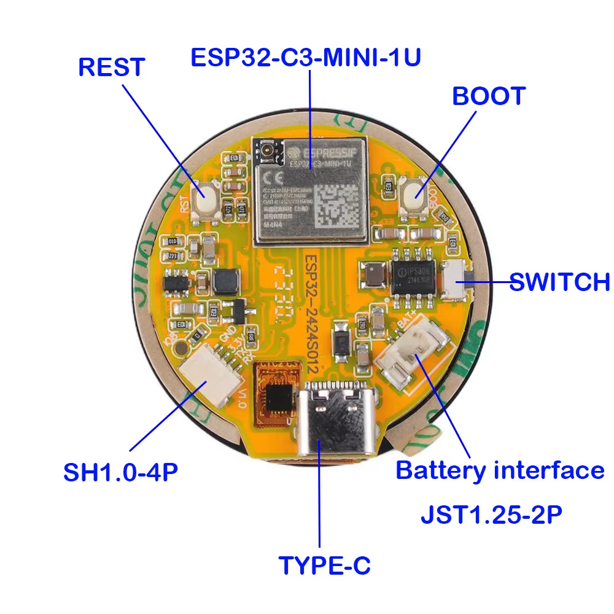
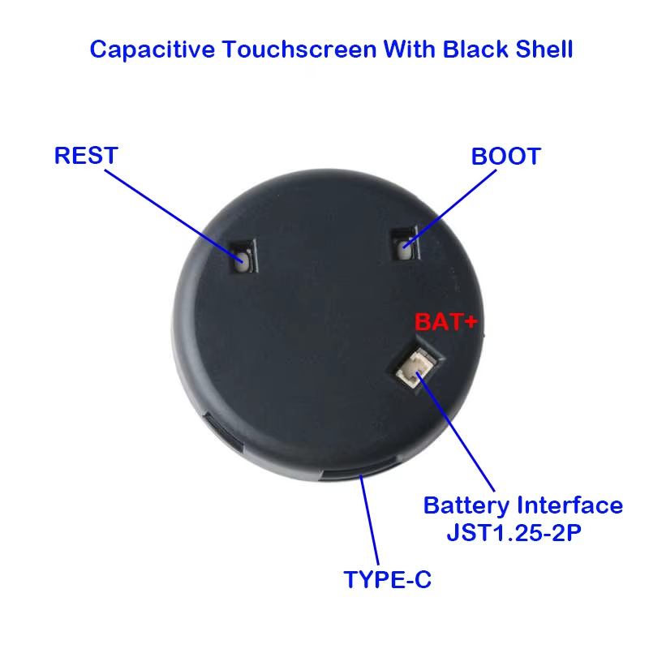

# ESP32-2424S012 — Hardware Reference

**Product:** ESP32-2424S012 v1.0  
**Manufacturer:** 深圳市晶彩智能有限公司 (Shenzhen Jingcai Intelligent Co., Ltd.)  
**Form Factor:** 1.28" Round Display Smart Watch / IoT Display Module



---

## Table of Contents

1. [Microcontroller](#microcontroller)
2. [Display](#display)
3. [Touch Controller](#touch-controller)
4. [GPIO Pin Assignments](#gpio-pin-assignments)
5. [Power Management](#power-management)
6. [USB & Communication](#usb--communication)
7. [Schematic Overview](#schematic-overview)
8. [Software Stack](#software-stack)

---

## Microcontroller

| Specification     | Value                        |
|-------------------|------------------------------|
| **Module**        | ESP32-C3-MINI-1U             |
| **Core**          | Single-core RISC-V 32-bit    |
| **Clock**         | Up to 160 MHz                |
| **Flash**         | 4 MB (embedded in module)    |
| **WiFi**          | 802.11 b/g/n (2.4 GHz)       |
| **Bluetooth**     | BLE 5.0                      |
| **Operating Voltage** | 3.3 V                    |
| **Debug Interface** | USB-JTAG (built-in)        |
| **UART Baud Rate** | 115200 bps                  |

---

## Display

| Specification       | Value                        |
|---------------------|------------------------------|
| **Size**            | 1.28 inches (diagonal)       |
| **Shape**           | Circular                     |
| **Resolution**      | 240 × 240 px                 |
| **Panel Type**      | TFT LCD (IPS)                |
| **Driver IC**       | GC9A01 (Galaxycore)          |
| **Color Depth**     | 16-bit RGB565                |
| **Interface**       | SPI (3-wire, write-only)     |
| **SPI Mode**        | Mode 0                       |
| **SPI Write Speed** | 80 MHz                       |
| **SPI Read Speed**  | 20 MHz (not used)            |
| **Color Inversion** | Enabled                      |
| **Backlight**       | LED, controlled via GPIO 3 + AO3402 MOSFET + R8 (3.9 Ω) |
| **Connector**       | J3 — 16-pin FPC              |

---

## Touch Controller

| Specification       | Value                        |
|---------------------|------------------------------|
| **Model**           | CST816D (Capacitive)         |
| **Interface**       | I2C                          |
| **I2C Address**     | 0x15                         |
| **SDA Pin**         | GPIO 4                       |
| **SCL Pin**         | GPIO 5                       |
| **Interrupt Pin**   | GPIO 0 (active low)          |
| **Reset Pin**       | GPIO 1                       |
| **Reset Sequence**  | LOW 10 ms → HIGH 300 ms      |
| **Gestures**        | SingleTap, DoubleTap, LongPress, SlideUp/Down/Left/Right |
| **Coordinate Bits** | 12-bit X / 12-bit Y          |

---

## GPIO Pin Assignments

| GPIO | Net / Label  | Direction | Function                              |
|------|--------------|-----------|---------------------------------------|
| 0    | TP_INT       | Input     | Touch controller interrupt            |
| 1    | TP_RST       | Output    | Touch controller reset                |
| 2    | DC           | Output    | Display Data/Command select           |
| 3    | LED / BL     | Output    | Display backlight enable (HIGH = on)  |
| 4    | TP_SDA       | I/O       | I2C SDA — touch controller            |
| 5    | TP_SCL       | Input     | I2C SCL — touch controller            |
| 6    | SPICLK       | Output    | SPI clock — display                   |
| 7    | SPIMOSI      | Output    | SPI MOSI — display data               |
| 8    | S1 / BOOT    | Input     | User button / Boot mode               |
| 9    | BOOT / KEY   | Input     | BOOT button (auto-play control)       |
| 10   | SPICS        | Output    | SPI chip select — display (active low)|
| 18   | USB D−       | I/O       | USB full-speed D−                     |
| 19   | USB D+       | I/O       | USB full-speed D+                     |
| 20   | RX / UART RX | Input     | UART receive                          |
| 21   | TX / UART TX | Output    | UART transmit                         |

> **Note:** MISO is not connected (−1). The display is write-only.

---

## Power Management

### Battery Charging Circuit (Lithium Battery Circuit block)

| Component | Value / Role                                      |
|-----------|---------------------------------------------------|
| **U2**    | TP4054 — single-cell Li-ion linear charger IC     |
| **Input** | 5 V from USB Type-C (VBUS via D1 — 1N5819W diode)|
| **Output**| VOUT-BAT → DC-DC converter                       |
| **P2**    | JST 1.25-2P battery connector (BAT+ / BAT−)      |
| **LED1/2/3** | Charge status indicator LEDs                  |
| **KEY**   | Battery key / enable signal                       |

### DC-DC Converter (DC-DC block)

| Component | Value / Role                                   |
|-----------|------------------------------------------------|
| **U4**    | DC-DC boost/buck converter                     |
| **Input** | VOUT-BAT (battery or USB regulated)            |
| **Output**| 3.3 V rail for ESP32-C3 and peripherals        |
| **L2**    | Inductor (switching element)                   |
| **Pins**  | BS, SW, VIN, FB, EN, GND                       |
| **C11–C13** | Input/output filter capacitors              |
| **R12/R13** | Feedback resistor divider (sets 3.3 V out)  |

### Power Rails Summary

| Rail      | Source               | Consumers                        |
|-----------|----------------------|----------------------------------|
| VBUS (5 V)| USB Type-C           | TP4054 charger, DC-DC input      |
| VOUT-BAT  | Battery / TP4054 out | DC-DC converter input            |
| 3.3 V     | DC-DC output         | ESP32-C3, display, touch IC      |
| BAT+      | Li-ion battery       | Charging circuit                 |

---

## USB & Communication

| Feature        | Details                                      |
|----------------|----------------------------------------------|
| **Connector**  | USB Type-C (USB1)                            |
| **Protocol**   | USB Full-Speed (12 Mbps)                     |
| **D− / D+**    | GPIO 18 / GPIO 19 (ESP32-C3 native USB)      |
| **ESD Protection** | D1 — 1N5819W Schottky diode on VBUS     |
| **UART TX/RX** | GPIO 21 / GPIO 20 (via USB-JTAG bridge)      |
| **Baud Rate**  | 115200 bps                                   |
| **Debug**      | USB-JTAG (built into ESP32-C3, no separate chip) |

---

## Schematic Overview

The full schematic (`5-Schematic/ESP32-2424S012-V1.0.png`) is divided into five functional blocks:

```
┌─────────────────────────────────────────────────────────────────┐
│  ESP32 Block                    │  LCM Block (Display)          │
│  U1: ESP32-C3-MINI-1U           │  J3: 1.28" GC9A01 FPC         │
│  • All GPIO routing             │  • SPI: SCLK, MOSI, CS, DC    │
│  • BOOT button (TS-4.2×3.2×2.5)│  • Touch: TP_SCL, TP_SDA, INT │
│  • RST button  (TS-4.2×3.2×2.5)│  • Backlight: Q2 (AO3402)     │
│  • S1 button on IO8             │    + R8 (3.9 Ω) via IO3       │
│  • Pull-ups: R14, R3 (10 kΩ)   │  • Pull-ups: R5, R6 (4.7 kΩ)  │
│  • Decoupling: C1, C2 (100 nF) │    on TP_SCL / TP_SDA         │
│                                 │  • R7 (10 kΩ) on gate of Q2   │
├─────────────────────────────────┴───────────────────────────────┤
│  Lithium Battery Circuit                                        │
│  U2: TP4054 charger IC                                          │
│  • VIN ← 5 V (USB VBUS)                                         │
│  • VOUT → VOUT-BAT net                                          │
│  • BAT± ↔ P2 (JST 1.25-2P connector)                           │
│  • LED1/LED2/LED3 status indicators                             │
│  • SW1 (4-pin) — power switch                                   │
│  • R9, R10, R11 — current-limiting resistors                    │
│  • C3, C4, C5, C8 — filter capacitors                          │
├─────────────────────────────────────────────────────────────────┤
│  DC-DC Block                                                    │
│  U4: DC-DC switching converter (VOUT-BAT → 3.3 V)              │
│  • L2 inductor (switching element)                              │
│  • R12/R13 feedback divider                                     │
│  • C10, C11, C12, C13 filter caps                               │
│  • EN pin controlled by U2 output                               │
├─────────────────────────────────────────────────────────────────┤
│  Type-C Block                                                   │
│  USB1: USB Type-C receptacle                                    │
│  • VBUS → D1 (1N5819W) → 5 V rail                              │
│  • D− (A7/B7) → USB-DN → GPIO 18                               │
│  • D+ (A6/B6) → USB-DP → GPIO 19                               │
│  • CC1/CC2 for cable orientation detection                      │
│  • GND shields A1/A12/B1/B12                                    │
└─────────────────────────────────────────────────────────────────┘
```

### Signal Flow Diagram

```
USB Type-C ──VBUS──► 1N5819W ──5V──► TP4054 ──VOUT-BAT──► DC-DC ──3.3V──► ESP32-C3
                                         │                                      │
                                      BAT±                              GPIO 6,7,10,2,3
                                     (JST P2)                           └──► GC9A01 (Display)
                                                                               │
                                                                         GPIO 4,5,0,1
                                                                         └──► CST816D (Touch)
```

### J3 Display Connector Pin Map (1.28" FPC, 16-pin)

| Pin | Net        | Connected to       |
|-----|------------|--------------------|
| 1   | GND        | Ground             |
| 2   | LED−       | Backlight cathode  |
| 3   | GND        | Ground             |
| 4   | GND        | Ground             |
| 5   | MISO       | (not connected)    |
| 6   | SPICLK     | GPIO 6             |
| 7   | SPIMOSI    | GPIO 7             |
| 8   | DC         | GPIO 2             |
| 9   | CS         | GPIO 10            |
| 10  | RST        | (not connected)    |
| 11  | GND        | Ground             |
| 12  | TP_SCL     | GPIO 5             |
| 13  | TP_SDA     | GPIO 4             |
| 14  | TP_INT     | GPIO 0             |
| 15  | 3.3V       | Power              |
| 16  | 3.3V       | Power              |

---

## Software Stack

| Component       | Library / Version          | Purpose                          |
|-----------------|----------------------------|----------------------------------|
| **Framework**   | Arduino (ESP-IDF based)    | Base runtime                     |
| **Graphics**    | LovyanGFX v1               | SPI display driver + GC9A01      |
| **GUI**         | LVGL 8.x                   | Widgets, animations, events      |
| **Touch Driver**| CST816D (custom)           | I2C capacitive touch + gestures  |
| **SPI Host**    | SPI2_HOST + DMA_CH_AUTO    | Hardware SPI with DMA            |

### Flash Memory Map

| Address  | Binary                        |
|----------|-------------------------------|
| `0x0000` | Bootloader                    |
| `0x8000` | Partition table               |
| `0xE000` | OTA data (boot_app0)          |
| `0x10000`| Application firmware          |

---

*Schematic source: `5-Schematic/ESP32-2424S012-V1.0.png`*  
*Module pinout: `5-Schematic/ESP32-C3-MINI-1U.jpg`*  
*Datasheet: `4-Driver_IC_Data_Sheet/esp32-c3-mini-1_datasheet_en.pdf`*
