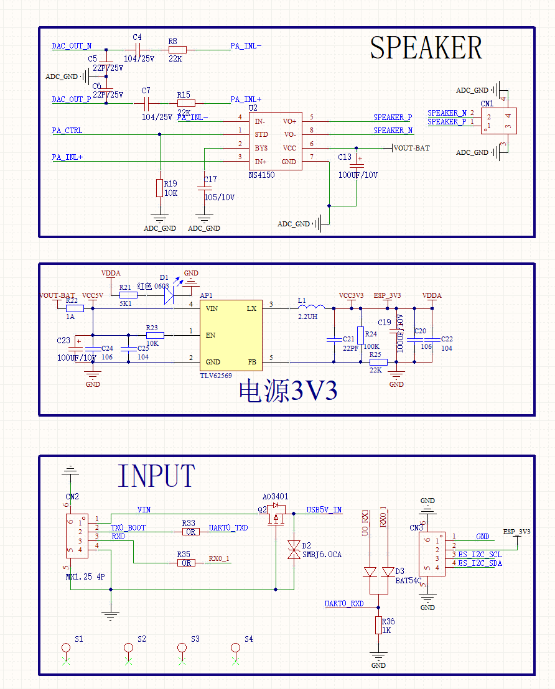
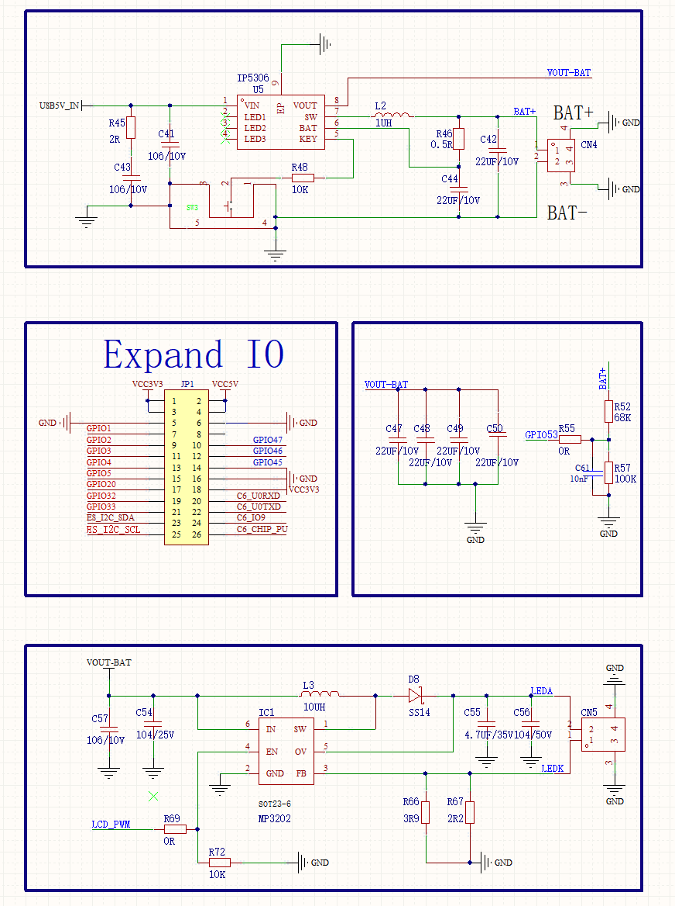
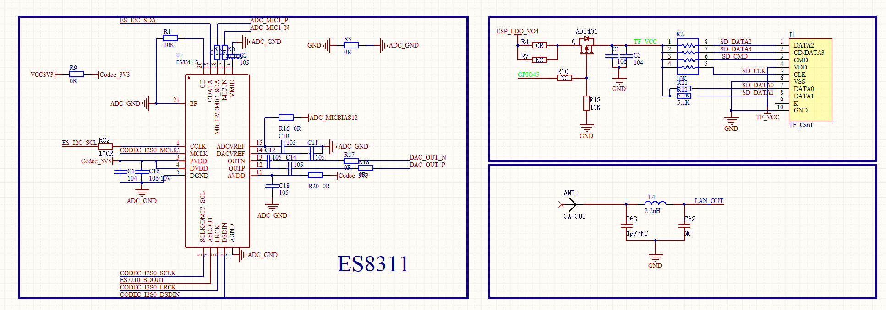
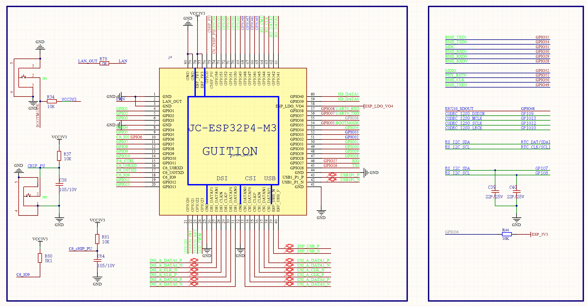
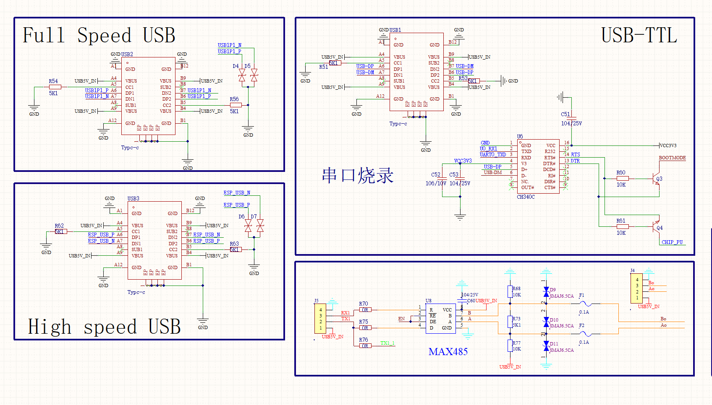
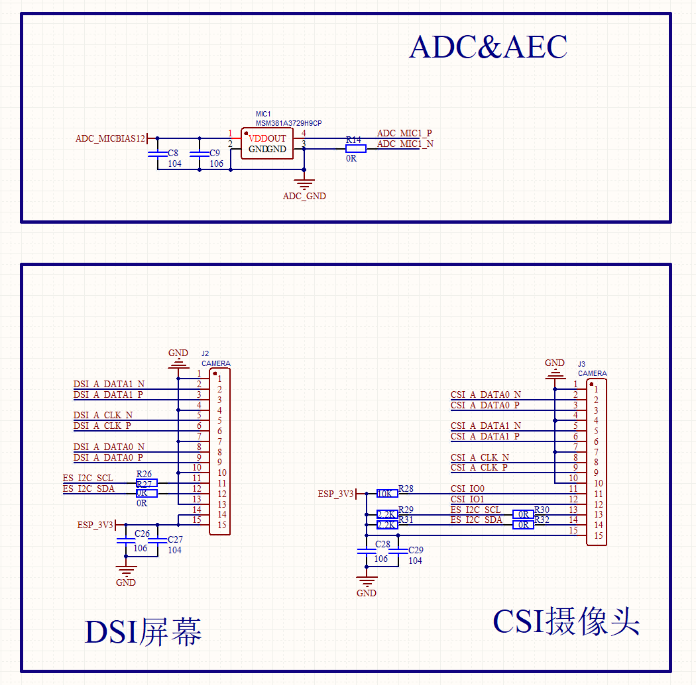
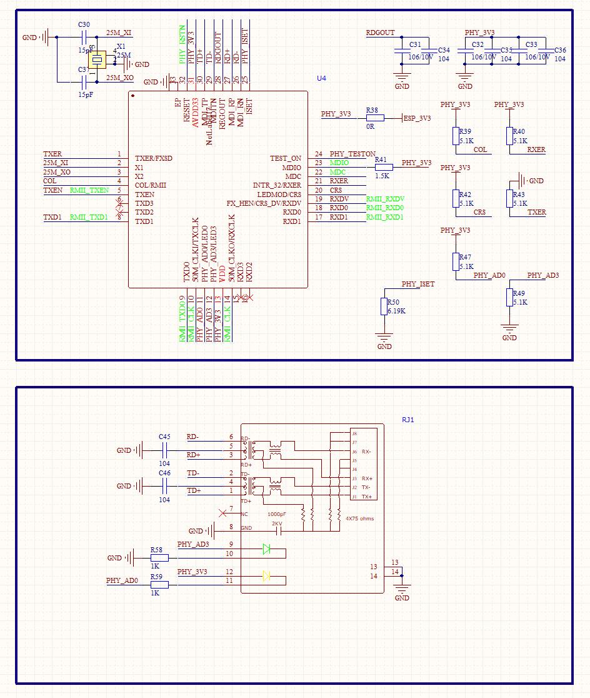
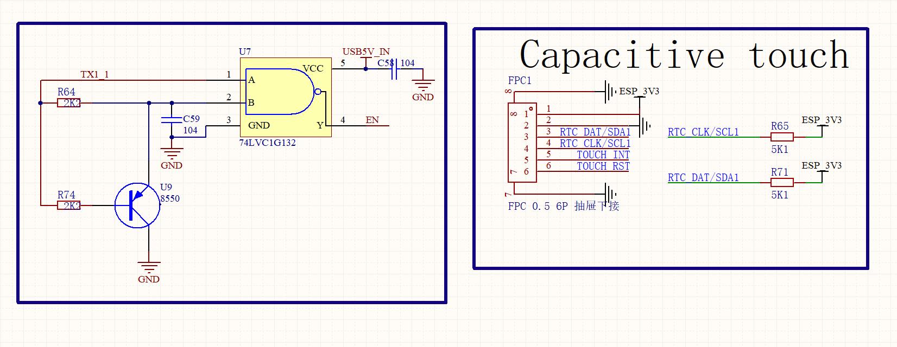

# JC-ESP32P4-M3-DEV — Hardware Reference

**Product:** JC-ESP32P4-M3-DEV v1.0  
**Manufacturer:** Guition / Shenzhen Jingcai Intelligent Co., Ltd.  
**Form Factor:** High-performance IoT development board with MIPI display and Ethernet  


---

## Table of Contents

1. [Microcontroller](#microcontroller)
2. [Co-Processor](#co-processor)
3. [Display](#display)
4. [Touch Controller](#touch-controller)
5. [Audio](#audio)
6. [GPIO Pin Assignments](#gpio-pin-assignments)
7. [Power Management](#power-management)
8. [USB & Communication](#usb--communication)
9. [Ethernet](#ethernet)
10. [Storage](#storage)
11. [Schematic Overview](#schematic-overview)
12. [Software Stack](#software-stack)

---

## Microcontroller

| Specification | Value |
|---------------|-------|
| **Module** | ESP32-P4 (Espressif) |
| **Core** | Dual-core RISC-V 32-bit (HP) + LP core |
| **Clock** | Up to 400 MHz |
| **Flash** | 16 MB NOR (QIO, external) |
| **PSRAM** | 32 MB (in-package, 200 MHz) |
| **Operating Voltage** | 3.3 V |
| **Debug Interface** | USB-JTAG + CH340 UART (USB Type-C) |
| **UART Baud Rate** | 115200 bps |

---

## Co-Processor

| Specification | Value |
|---------------|-------|
| **Module** | ESP32-C6-MINI |
| **Core** | Single-core RISC-V 32-bit |
| **Wi-Fi** | 802.11ax (Wi-Fi 6), 2.4 GHz |
| **Bluetooth** | BT 5 / BLE |
| **Interface to P4** | SDIO (4-bit) |
| **Reset Pin** | GPIO54 |

---

## Display

| Specification | Value |
|---------------|-------|
| **Interface** | MIPI 2-lane DSI |
| **Driver IC** | JD9365 |
| **Resolution** | 800 × 1280 px (portrait) |
| **Color Depth** | 16-bit RGB565 |
| **Backlight** | LEDC PWM — GPIO23 |
| **Reset** | Not connected (−1) |
| **Connector** | MIPI DSI FPC |

---

## Touch Controller

| Specification | Value |
|---------------|-------|
| **Model** | GT911 (Goodix) |
| **Interface** | I2C (shared bus) |
| **SDA Pin** | GPIO7 |
| **SCL Pin** | GPIO8 |
| **Interrupt Pin** | Not connected (−1) |
| **Reset Pin** | Not connected (−1) |
| **Coordinate Bits** | 10-bit X / 10-bit Y |
| **Max Touch Points** | 5 |

---

## Audio

| Specification | Value |
|---------------|-------|
| **Codec** | ES8311 (mono, 24-bit) |
| **I2C Address** | 0x18 |
| **I2C SDA** | GPIO7 (shared) |
| **I2C SCL** | GPIO8 (shared) |
| **I2S MCLK** | GPIO13 |
| **I2S BCLK** | GPIO12 |
| **I2S WS (LCLK)** | GPIO10 |
| **I2S DOUT (TX)** | GPIO9 |
| **I2S DIN (RX / mic)** | GPIO48 |
| **Power Amp enable** | GPIO11 (active high) |
| **Speaker** | 8 Ω / 2 W — header connector |
| **Microphone** | Onboard MEMS mic |

---

## GPIO Pin Assignments

| GPIO | Net / Label | Direction | Function |
|------|-------------|-----------|----------|
| 7 | I2C_SDA | I/O | I2C SDA — GT911 touch + ES8311 codec |
| 8 | I2C_SCL | Output | I2C SCL — GT911 touch + ES8311 codec |
| 9 | I2S_DOUT | Output | I2S data out — ES8311 speaker |
| 10 | I2S_LCLK | Output | I2S word select (LR clock) — ES8311 |
| 11 | AMP_PWR | Output | Power amplifier enable (HIGH = on) |
| 12 | I2S_BCLK | Output | I2S bit clock — ES8311 |
| 13 | I2S_MCLK | Output | I2S master clock — ES8311 |
| 14 | C6_SDIO_D0 | I/O | ESP32-C6 SDIO data 0 |
| 15 | C6_SDIO_D1 | I/O | ESP32-C6 SDIO data 1 |
| 16 | C6_SDIO_D2 | I/O | ESP32-C6 SDIO data 2 |
| 17 | C6_SDIO_D3 | I/O | ESP32-C6 SDIO data 3 |
| 18 | C6_SDIO_CLK | Output | ESP32-C6 SDIO clock |
| 19 | C6_SDIO_CMD | I/O | ESP32-C6 SDIO command |
| 23 | LCD_BL | Output | Display backlight (LEDC PWM) |
| 26 | RS485_TXD | Output | RS485 / UART1 transmit |
| 27 | RS485_RXD | Input | RS485 / UART1 receive |
| 31 | ETH_MDC | Output | Ethernet MDC — IP101 PHY |
| 39 | SD_D0 | I/O | SD card SDIO data 0 |
| 40 | SD_D1 | I/O | SD card SDIO data 1 |
| 41 | SD_D2 | I/O | SD card SDIO data 2 |
| 42 | SD_D3 | I/O | SD card SDIO data 3 |
| 43 | SD_CLK | Output | SD card SDIO clock |
| 44 | SD_CMD | I/O | SD card SDIO command |
| 48 | I2S_DSIN | Input | I2S data in — onboard microphone |
| 50 | ETH_CLK | Input | Ethernet RMII clock input — IP101 |
| 51 | ETH_PWR | Output | Ethernet PHY power / reset |
| 52 | ETH_MDIO | I/O | Ethernet MDIO — IP101 PHY |
| 54 | C6_RST | Output | ESP32-C6 reset |

> **Note:** MIPI DSI lanes (display) and MIPI CSI lanes (camera) are routed internally and do not use numbered GPIO pads.

---

## Power Management

### Supply

| Input | Source | Details |
|-------|--------|---------|
| USB (VBUS) | USB Type-C | 5 V, ≥ 500 mA required |
| Battery | JST Li-Ion connector | 3.7 V single-cell |

### Power Rails

| Rail | Source | Consumers |
|------|--------|-----------|
| 5 V (VBUS) | USB Type-C | Charger IC, DC-DC input |
| VBAT | Li-Ion battery | DC-DC input |
| 3.3 V | DC-DC output | ESP32-P4, ESP32-C6, display, touch, codec |

---

## USB & Communication

| Feature | Details |
|---------|---------|
| **USB 2.0 OTG HS** | Type-C — High-Speed Host Controller (480 Mbps) |
| **USB 1.1 OTG FS** | Type-C — Full-Speed Host Controller (12 Mbps) |
| **Debug / Flash** | USB Type-C — CH340 UART bridge |
| **RS485** | UART1 — TX=GPIO26, RX=GPIO27 — MX1.25 connector, 115200 bps |
| **UART** | MX1.25 connector (shared with RS485 port) |
| **I2C expansion** | HS 1.0 pitch connector — GPIO7 / GPIO8 |

---

## Ethernet

| Feature | Details |
|---------|---------|
| **PHY** | IP101 — 100 Mbps RMII |
| **Connector** | RJ45 with integrated magnetics |
| **MDC** | GPIO31 |
| **MDIO** | GPIO52 |
| **PHY Power / Reset** | GPIO51 |
| **RMII CLK** | GPIO50 (external input from IP101) |
| **PHY Address** | 1 |

---

## Storage

| Feature | Details |
|---------|---------|
| **SD / TF Card** | SDIO 3.0 — 4-bit, D0=GPIO39, D1=GPIO40, D2=GPIO41, D3=GPIO42, CMD=GPIO44, CLK=GPIO43 |
| **Battery ADC** | ADC2 channel 4 — monitors Li-Ion cell voltage |

---

## Schematic Overview

The schematic is split across 8 sheets. All images are in `images/`.

### Sheet 1 — Power & Speaker


### Sheet 2 — Expansion I/O & Battery


### Sheet 3 — ES8311 Audio Codec & TF Card


### Sheet 4 — ESP32-P4 Core


### Sheet 5 — USB & RS485


### Sheet 6 — MIPI DSI & MIPI CSI


### Sheet 7 — RJ45 / Ethernet


### Sheet 8 — Other


### Signal Flow

```
USB Type-C ──5V──► Charger IC ──VBAT──► DC-DC ──3.3V──► ESP32-P4
  (VBUS)                │                                     │
                    JST battery                          GPIO7/8 (I2C)
                                                         ├──► GT911 (Touch)
                                                         └──► ES8311 (Audio codec)
                                                               │
                                                         GPIO9-13, 48 (I2S)
                                                         └──► Speaker / Mic

ESP32-P4 ──SDIO──► ESP32-C6-MINI ──Wi-Fi 6 / BLE
           GPIO14-19, 54

ESP32-P4 ──RMII──► IP101 PHY ──RJ45 (Ethernet 100M)
           GPIO31, 50-52

ESP32-P4 ──MIPI DSI──► JD9365 ──► 800×1280 display
ESP32-P4 ──I2C──────► GT911  ──► Capacitive touch
```

---

## Software Stack

| Component | Library / Version | Purpose |
|-----------|-------------------|---------|
| **Framework (IDF)** | ESP-IDF v5.5+ | Primary production framework |
| **Framework (Arduino)** | ESP32 Arduino Core v3.2.1+ | Rapid prototyping |
| **Display driver** | JD9365 (custom BSP) | MIPI DSI panel init |
| **Touch driver** | GT911 (custom BSP) | I2C capacitive touch |
| **GUI** | LVGL v8 / v9 | Widgets, animations, events |
| **Audio codec** | ES8311 via esp-codec-dev | Playback + recording |
| **BSP** | espressif__esp32_p4_function_ev_board | Board support package |

### Flash Memory Layout (default)

| Address | Partition |
|---------|-----------|
| `0x0000` | Bootloader |
| `0x8000` | Partition table |
| `0x10000` | Application firmware |
| Remaining | SPIFFS / FATFS data |

---

*Schematics: `docs/5-Schematic/`*  
*Datasheets: `docs/4-Driver_IC_Data_Sheet/`*  
*Specification: `docs/2-Specification/JC-ESP32P4-M3-DEV Specifications-EN.pdf`*  
*Getting started: `docs/6-User_Manual/Getting started JC-ESP32P4-M3-DEV.pdf`*
