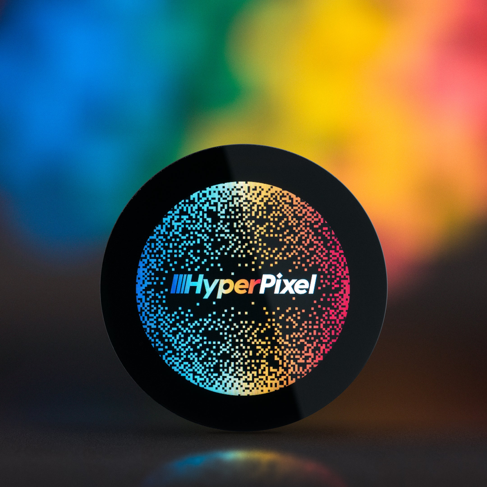
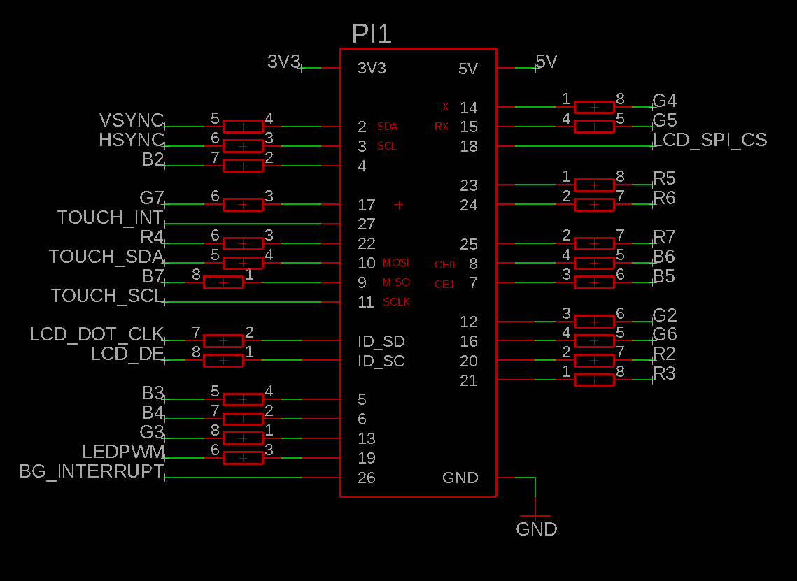
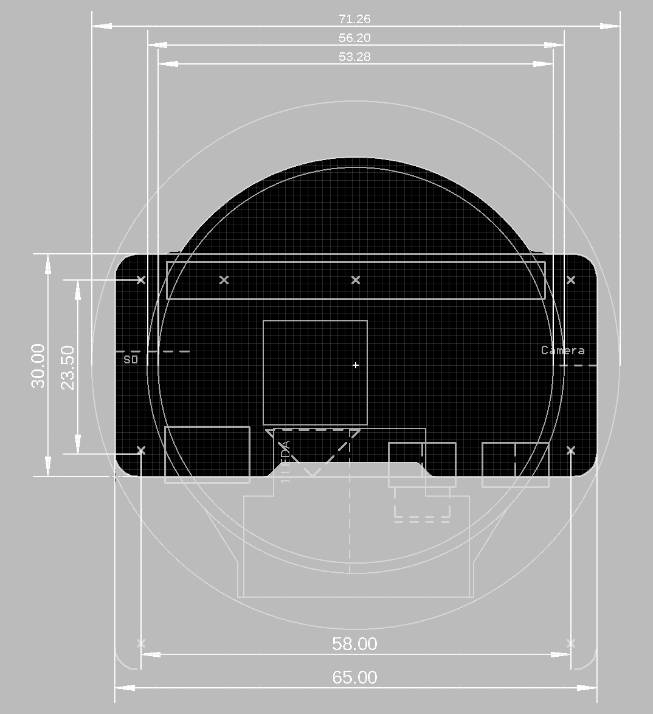

# HyperPixel 2.1 Round — Hardware Reference

**Product:** HyperPixel 2.1 Round (PIM579)  
**Manufacturer:** Pimoroni  
**Form Factor:** 2.1″ Round IPS Touchscreen Display HAT  
**Designed for:** Raspberry Pi (40-pin header) — adaptable to ESP32-P4 via RGB parallel interface  
**Shop:** https://shop.pimoroni.com/products/hyperpixel-round?variant=39381081882707  
**Driver repo:** https://github.com/pimoroni/hyperpixel2r



---





---

## Table of Contents

1. [Display](#display)
2. [Touch Controller](#touch-controller)
3. [Display IC — ST7701S](#display-ic--st7701s)
4. [Interface — RGB666 Parallel DPI](#interface--rgb666-parallel-dpi)
5. [RGB Timing Parameters](#rgb-timing-parameters)
6. [40-Pin GPIO Connector Pinout](#40-pin-gpio-connector-pinout)
7. [ST7701S SPI Initialisation Sequence](#st7701s-spi-initialisation-sequence)
8. [ESP32-P4 Pin Mapping](#esp32-p4-pin-mapping)
9. [Connecting to ESP32-P4](#connecting-to-esp32-p4)
10. [Software Stack (Raspberry Pi)](#software-stack-raspberry-pi)
11. [Software Stack (ESP32-P4 / ESP-IDF)](#software-stack-esp32-p4--esp-idf)

---

## Display

| Specification | Value |
|---------------|-------|
| **Size** | 2.1 inches (diagonal) |
| **Shape** | Circular (round) |
| **Resolution** | 480 × 480 px (corners inactive) |
| **Panel Type** | IPS TFT LCD |
| **PPI** | ~229 pixels per inch |
| **Color Depth** | 18-bit RGB666 (262,144 colours) |
| **Frame Rate** | 60 FPS |
| **Viewing Angle** | 175° |
| **Active Area** | 53.28 × 53.28 mm |
| **PCB Dimensions** | 71.80 × 71.80 × 10.8 mm |
| **Backlight** | GPIO-controlled (BCM19 on Pi / active high) |
| **Interface** | High-speed DPI (RGB666 parallel) |

---

## Touch Controller

| Specification | Value |
|---------------|-------|
| **Model** | FT5x06 (Focaltech) |
| **Type** | Capacitive, multi-touch |
| **Interface** | I2C (software / bit-bang) |
| **I2C Address** | `0x15` |
| **SDA Pin** | BCM11 (Pi) / GPIO7 (ESP32-P4) |
| **SCL Pin** | BCM10 (Pi) / GPIO8 (ESP32-P4) |
| **Interrupt Pin** | BCM27 (Pi) — falling edge |
| **Touch Resolution** | 480 × 480 px |
| **Physical Size** | 50 × 50 mm |
| **I2C Delay** | 4 µs (bit-bang) |

> ⚠️ On the Raspberry Pi, SPI_CLK (BCM11) and SPI_MOSI (BCM10) are **shared** between the ST7701S SPI init and the FT5x06 I2C bus. After the SPI init sequence completes at boot, these pins transition to I2C mode. The same approach applies on ESP32-P4.

---

## Display IC — ST7701S

| Specification | Value |
|---------------|-------|
| **Model** | ST7701S (Sitronix) |
| **Init Interface** | 3-wire SPI (9-bit: 1 D/C bit + 8 data bits) |
| **SPI CLK** | BCM11 / GPIO4 (ESP32-P4 suggestion) |
| **SPI MOSI** | BCM10 / GPIO5 (ESP32-P4 suggestion) |
| **SPI CS** | BCM18 / GPIO6 (ESP32-P4 suggestion) |
| **Operating Mode** | RGB666 parallel after init |
| **Color Mode (0x3A)** | `0x66` = 18-bit RGB |
| **MADCTL (0x36)** | `0x08` |

---

## Interface — RGB666 Parallel DPI

The display uses an **18-bit parallel RGB interface** (6 bits each for R, G, B) after SPI initialisation. This is identical to the `esp_lcd_rgb_panel` interface on ESP32-P4.

| Signal | Description |
|--------|-------------|
| R[2:7] | 6-bit Red data |
| G[2:7] | 6-bit Green data |
| B[2:7] | 6-bit Blue data |
| PCLK | Pixel clock |
| HSYNC | Horizontal sync |
| VSYNC | Vertical sync |
| DE | Data enable |

**DPI output format:** `0x7f216`
- `0x6` = DPI_OUTPUT_FORMAT_18BIT_666_CFG2
- RGB order: RGB
- HSYNC polarity: active high
- VSYNC polarity: active high

---

## RGB Timing Parameters

From `install.sh` → `dpi_timings`:

```
480 0 10 16 55 480 0 15 60 15 0 0 0 60 0 19200000 6
```

| Parameter | Value |
|-----------|-------|
| **H resolution** | 480 px |
| **H front porch** | 10 px |
| **H sync pulse** | 16 px |
| **H back porch** | 55 px |
| **V resolution** | 480 px |
| **V front porch** | 15 px |
| **V sync pulse** | 60 px |
| **V back porch** | 15 px |
| **Pixel clock** | 19,200,000 Hz (19.2 MHz) |

---

## 40-Pin GPIO Connector Pinout

The HyperPixel uses a standard Raspberry Pi 2×20 pin header. All signals are 3.3V logic.

| Pin | Signal | Type | Description |
|-----|--------|------|-------------|
| 1 | 3V3 | Power | 3.3V supply |
| 2 | 5V | Power | 5V supply (backlight) |
| 3 | SPI_MOSI / Touch_SDA | I/O | Shared: SPI data (init) / I2C SDA (touch) |
| 4 | 5V | Power | |
| 5 | SPI_CLK / Touch_SCL | Out | Shared: SPI clock (init) / I2C SCL (touch) |
| 6 | GND | Ground | |
| 7 | B2 | Out | Blue bit 2 (LSB) |
| 8 | R2 | Out | Red bit 2 (LSB) |
| 9 | GND | Ground | |
| 10 | R3 | Out | Red bit 3 |
| 11 | R4 | Out | Red bit 4 |
| 12 | G2 | Out | Green bit 2 (LSB) |
| 13 | Touch_INT | In | Touch interrupt (active low) |
| 14 | GND | Ground | |
| 15 | G3 | Out | Green bit 3 |
| 16 | G4 | Out | Green bit 4 |
| 17 | 3V3 | Power | |
| 18 | SPI_CS | Out | ST7701S SPI chip select |
| 19 | VSYNC | Out | Vertical sync |
| 20 | GND | Ground | |
| 21 | PCLK | Out | Pixel clock |
| 22 | R5 | Out | Red bit 5 |
| 23 | HSYNC | Out | Horizontal sync |
| 24 | R6 | Out | Red bit 6 |
| 25 | GND | Ground | |
| 26 | B5 | Out | Blue bit 5 |
| 27 | DE | Out | Data enable |
| 28 | R7 | Out | Red bit 7 (MSB) |
| 29 | B3 | Out | Blue bit 3 |
| 30 | GND | Ground | |
| 31 | B4 | Out | Blue bit 4 |
| 32 | G5 | Out | Green bit 5 |
| 33 | G6 | Out | Green bit 6 |
| 34 | GND | Ground | |
| 35 | LEDPWM | Out | Backlight PWM |
| 36 | G7 | Out | Green bit 7 (MSB) |
| 37 | B6 | Out | Blue bit 6 |
| 38 | B7 | Out | Blue bit 7 (MSB) |
| 39 | GND | Ground | |
| 40 | G8 | Out | (unused in 18-bit mode) |

---

## ST7701S SPI Initialisation Sequence

The display **must be initialised over SPI before RGB parallel mode works**. The sequence below is translated directly from [`dist/hyperpixel2r-init`](https://github.com/pimoroni/hyperpixel2r/blob/main/dist/hyperpixel2r-init).

**SPI protocol:** 3-wire, 9-bit per transfer (bit 8 = 0 for command, 1 for data), CS active low.

```c
// Page 1
CMD(0xFF); DATA(0x77); DATA(0x01); DATA(0x00); DATA(0x00); DATA(0x10);
CMD(0xC0); DATA(0x3B); DATA(0x00);   // Scan line
CMD(0xC1); DATA(0x0B); DATA(0x02);   // VBP
CMD(0xC2); DATA(0x00); DATA(0x02);
CMD(0xCC); DATA(0x10);

// Positive Gamma
CMD(0xB0);
DATA(0x02); DATA(0x13); DATA(0x1B); DATA(0x0D);
DATA(0x10); DATA(0x05); DATA(0x08); DATA(0x07);
DATA(0x07); DATA(0x24); DATA(0x04); DATA(0x11);
DATA(0x0E); DATA(0x2C); DATA(0x33); DATA(0x1D);

// Negative Gamma
CMD(0xB1);
DATA(0x05); DATA(0x13); DATA(0x1B); DATA(0x0D);
DATA(0x11); DATA(0x05); DATA(0x08); DATA(0x07);
DATA(0x07); DATA(0x24); DATA(0x04); DATA(0x11);
DATA(0x0E); DATA(0x2C); DATA(0x33); DATA(0x1D);

// Page 2
CMD(0xFF); DATA(0x77); DATA(0x01); DATA(0x00); DATA(0x00); DATA(0x11);
CMD(0xB0); DATA(0x5D);   // VOP
CMD(0xB1); DATA(0x43);   // VCOM
CMD(0xB2); DATA(0x81);   // VGH = 12V
CMD(0xB3); DATA(0x80);
CMD(0xB5); DATA(0x43);   // VGL = -8.3V
CMD(0xB7); DATA(0x85);
CMD(0xB8); DATA(0x20);
CMD(0xC1); DATA(0x78);
CMD(0xC2); DATA(0x78);
CMD(0xD0); DATA(0x88);

CMD(0xE0); DATA(0x00); DATA(0x00); DATA(0x02);
CMD(0xE1);
DATA(0x03); DATA(0xA0); DATA(0x00); DATA(0x00);
DATA(0x04); DATA(0xA0); DATA(0x00); DATA(0x00);
DATA(0x00); DATA(0x20); DATA(0x20);
CMD(0xE2);
DATA(0x00); DATA(0x00); DATA(0x00); DATA(0x00);
DATA(0x00); DATA(0x00); DATA(0x00); DATA(0x00);
DATA(0x00); DATA(0x00); DATA(0x00); DATA(0x00); DATA(0x00);
CMD(0xE3); DATA(0x00); DATA(0x00); DATA(0x11); DATA(0x00);
CMD(0xE4); DATA(0x22); DATA(0x00);
CMD(0xE5);
DATA(0x05); DATA(0xEC); DATA(0xA0); DATA(0xA0);
DATA(0x07); DATA(0xEE); DATA(0xA0); DATA(0xA0);
DATA(0x00); DATA(0x00); DATA(0x00); DATA(0x00);
DATA(0x00); DATA(0x00); DATA(0x00); DATA(0x00);
CMD(0xE6); DATA(0x00); DATA(0x00); DATA(0x11); DATA(0x00);
CMD(0xE7); DATA(0x22); DATA(0x00);
CMD(0xE8);
DATA(0x06); DATA(0xED); DATA(0xA0); DATA(0xA0);
DATA(0x08); DATA(0xEF); DATA(0xA0); DATA(0xA0);
DATA(0x00); DATA(0x00); DATA(0x00); DATA(0x00);
DATA(0x00); DATA(0x00); DATA(0x00); DATA(0x00);
CMD(0xEB); DATA(0x00); DATA(0x00); DATA(0x40); DATA(0x40); DATA(0x00); DATA(0x00); DATA(0x00);
CMD(0xED);
DATA(0xFF); DATA(0xFF); DATA(0xFF); DATA(0xBA);
DATA(0x0A); DATA(0xBF); DATA(0x45); DATA(0xFF);
DATA(0xFF); DATA(0x54); DATA(0xFB); DATA(0xA0);
DATA(0xAB); DATA(0xFF); DATA(0xFF); DATA(0xFF);
CMD(0xEF); DATA(0x10); DATA(0x0D); DATA(0x04); DATA(0x08); DATA(0x3F); DATA(0x1F);

// Page 3
CMD(0xFF); DATA(0x77); DATA(0x01); DATA(0x00); DATA(0x00); DATA(0x13);
CMD(0xEF); DATA(0x08);

// Page 0 (back to normal)
CMD(0xFF); DATA(0x77); DATA(0x01); DATA(0x00); DATA(0x00); DATA(0x00);
CMD(0xCD); DATA(0x08);   // RGB format (COLCTRL)
CMD(0x36); DATA(0x08);   // MADCTL
CMD(0x3A); DATA(0x66);   // COLMOD: 18-bit RGB

CMD(0x11);               // Sleep Out — wait 120ms
// delay 120ms
CMD(0x29);               // Display ON — wait 20ms
// delay 20ms
```

---

## ESP32-P4 Pin Mapping

Suggested GPIO assignments for the JC-ESP32P4-M3-DEV board, keeping away from pins already used by onboard peripherals.

### RGB Data

| Signal | HyperPixel Pin | ESP32-P4 GPIO |
|--------|:--------------:|:-------------:|
| R2 | 8 | GPIO35 |
| R3 | 10 | GPIO36 |
| R4 | 11 | GPIO37 |
| R5 | 22 | GPIO38 |
| R6 | 24 | GPIO45 |
| R7 | 28 | GPIO46 |
| G2 | 12 | GPIO47 |
| G3 | 15 | GPIO53 |
| G4 | 16 | GPIO20 |
| G5 | 32 | GPIO21 |
| G6 | 33 | GPIO22 |
| G7 | 36 | GPIO24 |
| B2 | 7 | GPIO25 |
| B3 | 29 | GPIO26* |
| B4 | 31 | GPIO28 |
| B5 | 26 | GPIO29 |
| B6 | 37 | GPIO30 |
| B7 | 38 | GPIO33 |

> *GPIO26 is used for RS485 TX on JC-ESP32P4-M3-DEV — reassign if RS485 is needed.

### Timing / Control

| Signal | HyperPixel Pin | ESP32-P4 GPIO |
|--------|:--------------:|:-------------:|
| PCLK | 21 | GPIO34 |
| DE | 27 | GPIO32 |
| HSYNC | 23 | GPIO2 |
| VSYNC | 19 | GPIO3 |

### SPI Init (ST7701S — used only at boot)

| Signal | HyperPixel Pin | ESP32-P4 GPIO |
|--------|:--------------:|:-------------:|
| SPI_CLK | 5 | GPIO4 |
| SPI_MOSI | 3 | GPIO5 |
| SPI_CS | 18 | GPIO6 |

### Touch (FT5x06 I2C — shares SPI pins after init)

| Signal | HyperPixel Pin | ESP32-P4 GPIO |
|--------|:--------------:|:-------------:|
| SDA | 3 | GPIO7 *(shared I2C bus)* |
| SCL | 5 | GPIO8 *(shared I2C bus)* |
| INT | 13 | GPIO0 |

### Power & Ground

| Signal | HyperPixel Pin | ESP32-P4 |
|--------|:--------------:|:--------:|
| 3.3V | 1, 17 | 3V3 rail |
| 5V | 2, 4 | 5V rail |
| GND | 6, 9, 14, 20, 25, 30, 34, 39 | GND |
| LEDPWM | 35 | GPIO23 *(LEDC PWM — already LCD_BL on board)* |

---

## Connecting to ESP32-P4

### Option A — 40-Pin Breakout Board + Dupont Wires (quickest)

1. Buy a **Raspberry Pi 40-pin GPIO breakout board** (Amazon ~5€)
2. Plug HyperPixel 40-pin female header onto it
3. Connect individual Dupont wires to ESP32-P4 pin headers per the table above
4. Connect all GND pins together first, then 3V3, then signals

### Option B — Custom Adapter PCB (cleanest)

Design a small PCB with:
- 40-pin 2×20 female header (2.54mm) for HyperPixel
- Routed traces to 2.54mm single-row headers matching ESP32-P4 board layout

Manufacture at JLCPCB (~5€ for 5 boards, ~1–2 weeks delivery).

### ⚠️ Important wiring notes

1. **Always connect GND first** before signal or power lines
2. **SPI → I2C switchover:** GPIO4/5 are used as SPI during init, then re-initialised as I2C SCL/SDA for the touch controller
3. **3.3V only** — both ESP32-P4 and HyperPixel operate at 3.3V logic, no level shifting needed
4. **Do not press the display glass** when attaching/removing — the round glass edge overhangs the PCB

---

## Software Stack (Raspberry Pi)

| Component | Details |
|-----------|---------|
| **Kernel driver** | `dtoverlay=vc4-kms-dpi-hyperpixel2r` (Bullseye+) |
| **Legacy driver** | `dtoverlay=hyperpixel2r` + `dpi_timings` in `config.txt` |
| **Touch driver** | Python: [`hyperpixel2r-python`](https://github.com/pimoroni/hyperpixel2r-python) |
| **Display init** | [`hyperpixel2r-init`](https://github.com/pimoroni/hyperpixel2r/blob/main/dist/hyperpixel2r-init) — Python, runs as systemd service |
| **Backlight** | BCM19 (GPIO high = on) |

**config.txt entries (legacy mode):**
```
dtoverlay=hyperpixel2r
enable_dpi_lcd=1
dpi_group=2
dpi_mode=87
dpi_output_format=0x7f216
dpi_timings=480 0 10 16 55 480 0 15 60 15 0 0 0 60 0 19200000 6
```

---

## Software Stack (ESP32-P4 / ESP-IDF)

| Component | Library | Notes |
|-----------|---------|-------|
| **Display init** | Custom SPI driver | Bit-bang or `spi_master`, 9-bit mode, see init sequence above |
| **RGB panel** | `esp_lcd_new_rgb_panel` (built-in) | 18-bit, 19.2 MHz pclk |
| **Touch driver** | `espressif/esp_lcd_touch_ft5x06` | I2C addr `0x15` |
| **GUI** | LVGL v9 | 480×480, framebuffer in PSRAM |
| **Backlight** | `driver/ledc` | GPIO23, PWM channel |

**`esp_lcd_rgb_panel_config_t` values:**
```c
.data_width      = 18,
.h_res           = 480,
.v_res           = 480,
.pclk_hz         = 19200000,
.hsync_front_porch = 10,
.hsync_pulse_width = 16,
.hsync_back_porch  = 55,
.vsync_front_porch = 15,
.vsync_pulse_width = 60,
.vsync_back_porch  = 15,
.hsync_polarity    = 1,   // active high
.vsync_polarity    = 1,   // active high
.de_idle_high      = 0,
.pclk_active_neg   = 0,
```

---

*Driver source: [`github.com/pimoroni/hyperpixel2r`](https://github.com/pimoroni/hyperpixel2r)*  
*Product page: [`shop.pimoroni.com`](https://shop.pimoroni.com/products/hyperpixel-round?variant=39381081882707)*  
*Pinout reference: [`images/pinout.png`](images/pinout.png)*  
*Dimensional drawing: [`images/dimensions.png`](images/dimensions.png)*
